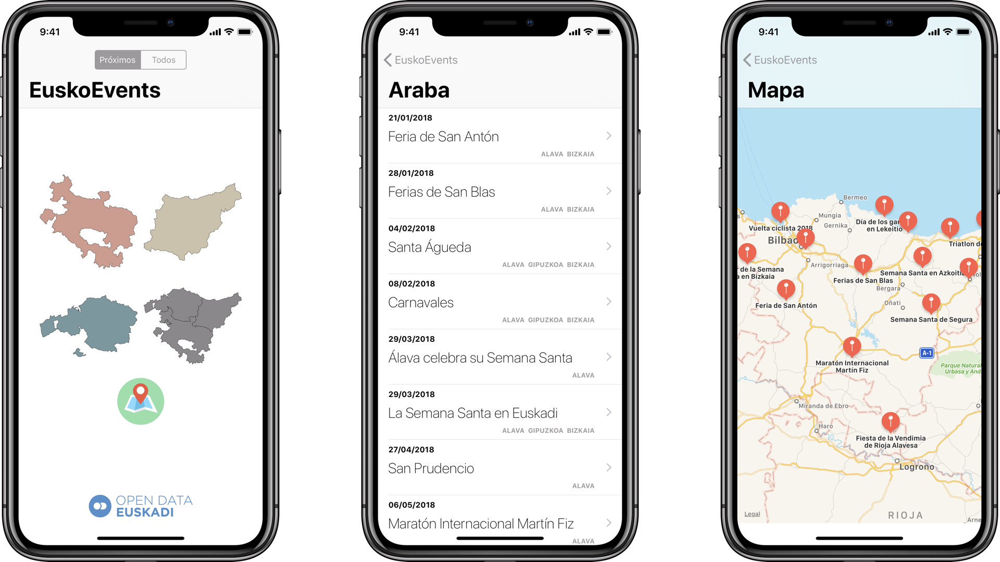

# EuskoEvents

Aplicación de ejemplo que lee [el _feed_ JSON de la agenda turística de Euskadi](http://opendata.euskadi.eus/catalogo/-/agenda-turistica-de-euskadi/) desde Open Data Euskadi.

El proyecto original es de [Asier Bilbao](https://github.com/abilbaotm).
